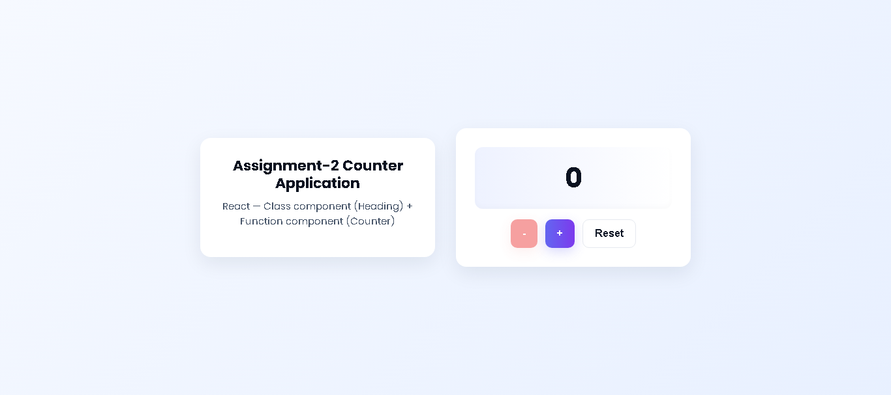

# Counter Application

Simple React counter app built with:
- A `Heading` component 
- A **class** & **function** component as counter.
- Attractive UI (cards, gradient, responsive)
- Count cannot go below `0`

## Screenshot:


## Features
- Displays **two separate counters**:
  - Class-based Counter
  - Function-based Counter
- Both counters prevent the value from going below 0
- Clean and attractive UI
- Responsive layout

## Run locally
```bash
npm install
npm run dev
# open http://localhost:5173
````

## Build

```bash
npm run build
# preview build locally
npm run preview
```

## Deploy (Vercel)

1. Push to GitHub.
2. Import the repository in Vercel.
3. Build command: `npm run build`
4. Output directory: `dist`
5. Deploy.

Alternatively, use the Vercel CLI:

```bash
npm i -g vercel
vercel
```

## Deployment

The application can be viewed in this url: [https://counter-app-olive-six.vercel.app](https://counter-app-olive-six.vercel.app)


## Changes Made

### V 0.2 - Files

New adjustment have been made by adding two counter components.

 * `src/components/ClassCounter.jsx` - **Class component** that renders the new counter components.

 * `src/components/FunctionCounter.jsx` - **Function Componenet** that renders the same counter component as a functon component.


### V 0.1 - Files

* `src/components/Heading.jsx` — **Class component** that renders the main heading
* `src/components/Counter.jsx` — **Function component** that manages the counter state
* `src/index.css` — styles
