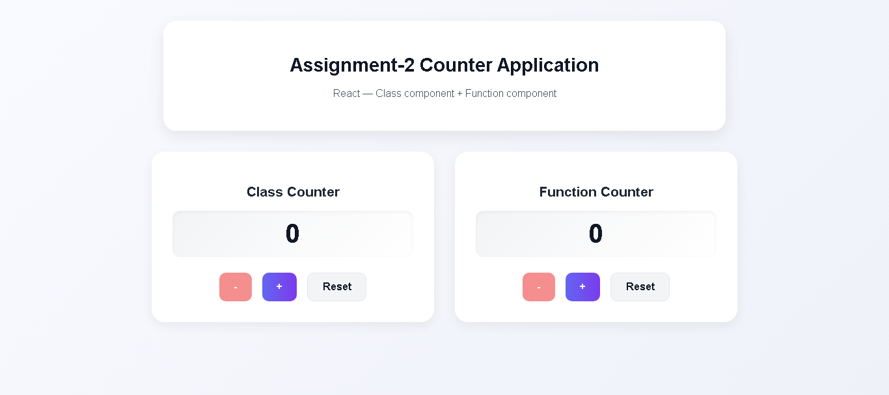

# Counter Application

Simple React counter app built with:
- A **class** component `Heading`
- A **function** component `Counter`
- Attractive UI (cards, gradient, responsive)
- Count cannot go below `0`

## Screenshot:


## Features
- Main heading: **Assignment-2 Counter Application**
- Both components are displayed in a row on larger screens
- Decrement button is disabled at 0 (count never negative)
- Accessible attributes and responsive layout
- Ready to deploy to Vercel

## Run locally
```bash
npm install
npm run dev
# open http://localhost:5173
````

## Build

```bash
npm run build
# preview build locally
npm run preview
```

## Deploy (Vercel)

1. Push to GitHub.
2. Import the repository in Vercel.
3. Build command: `npm run build`
4. Output directory: `dist`
5. Deploy.

Alternatively, use the Vercel CLI:

```bash
npm i -g vercel
vercel
```

## Deployment

The application can be viewed in this url: [https://counter-app-olive-six.vercel.app](https://counter-app-olive-six.vercel.app)

## Files

* `src/components/Heading.jsx` — **Class component** that renders the main heading
* `src/components/Counter.jsx` — **Function component** that manages the counter state
* `src/index.css` — styles
