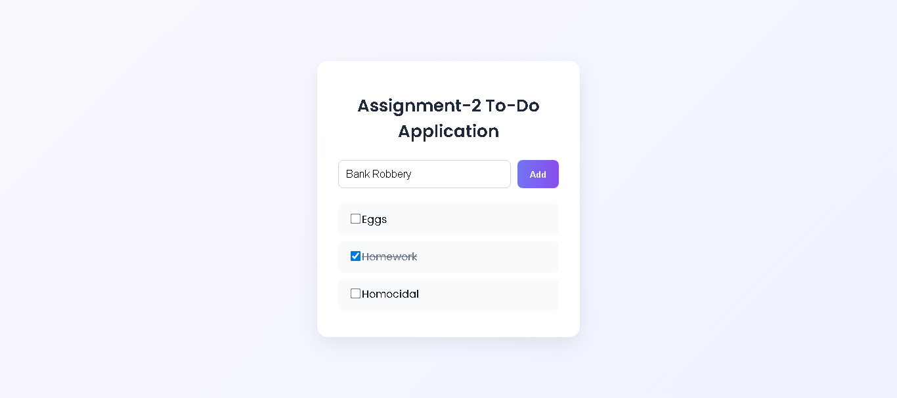

# Assignment-2 To-Do Application

Simple To-Do app built with React (Vite).

## ScreenShot



## Features
- Input field for new task
- Add button to add task
- Alert shown if input is empty
- Success alert when task added
- Dynamic rendering of todo list
- Checkbox to mark tasks complete
- Responsive and attractive design

## Run locally
```bash
npm install
npm run dev
````

## Build

```bash
npm run build
npm run preview
```

## Deploy (Vercel)

1. Push repo to GitHub.
2. Import into Vercel.
3. Build: `npm run build`
4. Output: `dist`

