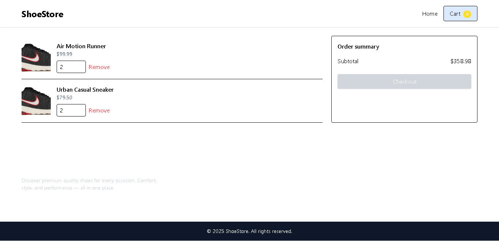

# Online Shoes — React (Vite) Shopping App

A modern single-page shoes store built with React + Vite + Tailwind CSS.  
This repository is a complete starter for Assignment-3 (Online Shoes Application): product listing, product pages, cart, and checkout (mock). The project is in [online-shoes](./online-shoes).

[App Deployed here]()

---

## Table of contents
- [Demo](#demo)
- [Screenshot](#screenshot)
- [Features](#features)
- [Tech stack](#tech-stack)
- [Project setup](#project-setup)
  - [Requirements](#requirements)
  - [Create project (init)](#create-project-init)
  - [Install dependencies](#install-dependencies)
  - [Run locally](#run-locally)
  - [Build for production](#build-for-production)
- [Deployment on Vercel](#deployment-on-vercel)
- [How to make self-made changes](#self-made-changes)
  - [Adding new products](#adding-new-products)
  - [Add real API/back-end](#add-real-apiback-end)
  - [Add payments (Stripe example)](#add-payments-stripe-example)
- [Contributing](#contributing)
- [Issues](#issues)
- [License](#license)
- [Acknowledgements](#acknowledgements)

---

## Demo
> This repo contains a local demo using mock data in `src/data/products.js`. Replace with your API or JSON server for dynamic data.

---

## Screenshot

- Home Page


- Search Home Function


- Product Page


- Cart Page


- Checkout Page


---

## Features
- Product listing & search
- Product detail page
- Cart with add/remove/update quantities (stored in `localStorage`)
- Order summary & mock checkout flow
- Responsive UI (mobile-first)
- Clean folder structure & components

---

## Tech stack
- React 18
- Vite
- Tailwind CSS
- React Router v6
- Local state via Context + useReducer
- Optional: Stripe / Razorpay for payments (instructions below)

---

## Project setup

### Requirements
- Node.js >= 18 (recommended)
- npm or Yarn

### Create project (init)
1. Clone this repo or create new:

```bash
   git clone <repo-url>
   cd online-shoes
```

2. If starting from scratch, init Vite:

   ```bash
   npm create vite@latest online-shoes -- --template react
   cd online-shoes
   npm install
   npm install tailwindcss @tailwindcss/vite  # tailwindcss installation
   ```

### Install dependencies

```bash
npm install
# or
yarn
```

(Ensure `package.json` contains scripts: `dev`, `build`, `preview`.)

### Run locally

```bash
npm run dev
# open http://localhost:5173
```

### Build for production

```bash
npm run build
npm run preview
```

---

## Deployment on Vercel

1. Push your repository to GitHub/GitLab/Bitbucket.
2. Visit [https://vercel.com](https://vercel.com) and import your project.
3. Set:

   * Framework: `Vite`
   * Build Command: `npm run build`
   * Output Directory: `dist`

4. Add environment variables (if you add a backend or payment keys) in Vercel dashboard:

   * `STRIPE_SECRET_KEY`, `RAZORPAY_KEY`, etc.

Vercel will detect and deploy. You can configure custom domains in Vercel settings.

---

## How to make self-made changes

### Adding new products

* Edit `src/data/products.js` and add new product objects. Provide `id`, `title`, `price`, `category`, `thumbnail`, `images[]`, `description`.

### Replace mock API with a real API

* Create a small Node/Express (or Next.js) backend that serves endpoints:

  * `GET /api/products` -> list
  * `GET /api/products/:id` -> details
* Replace direct imports with data fetching (e.g. `fetch('/api/products')`) in `Home` and `Product` pages.


## Contributing

1. Fork the repo
2. Create a branch: `git checkout -b feat/my-feature`
3. Make changes, run tests (if any)
4. Commit & push: `git push origin feat/my-feature`
5. Create a PR with a clear description of changes.

Please adhere to code style (Prettier/ESLint recommended). Include unit tests if adding business logic.


## Issues

Please open an issue when:

* You find a bug
* You want a feature added (describe use-case)
* You want help deploying or integrating payments

An example issue template is provided in `.github/ISSUE_TEMPLATE.md`.


## Acknowledgements

Created as a solution blueprint for Assignment-3: Online Shoes Application.


## MIT License

Copyright (c) 2025 Ranit Saha(Coderooz)

